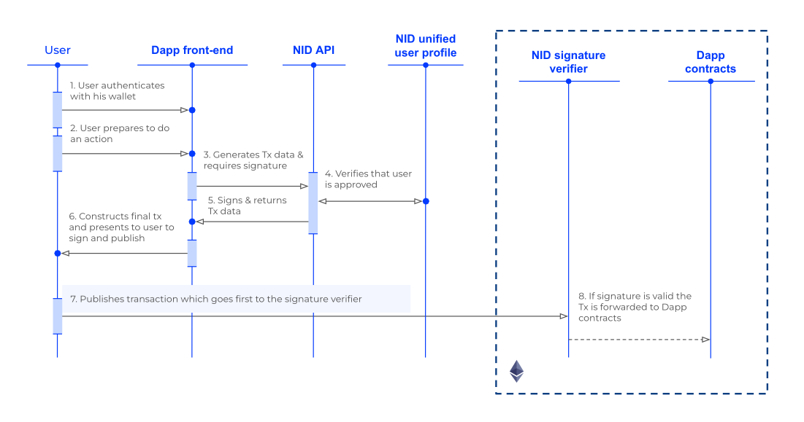

# ComPilot Signature Based Contracts

Repository for the ComPilot Signature Based Smart Contracts

This solution helps on-chain protocols gate access to their smart contracts on a per-transaction basis.

The client protocol will integrate ComPilot’s signature-based gating smart contracts in their own smart contracts.

Every time a user wants to call the protocol’s smart contract, they will have to obtain a signature from ComPilot’s API. They can only obtain this signature if they satisfy conditions set by the protocol in the ComPilot Dashboard. These conditions can be based on KYC conditions, but also inputs from the transaction itself.

Once the signature is fetched from the API, it will be added to the user’s inputs in the blockchain call. Then, this signature will be verified on chain using the smart contract that ComPilot provides, integrated into the protocol.

## Signature Based Gating

`./sig-gating-contracts`

More details about smart contract architecture in this [README](./sig-gating-contracts/README.md)

## SDK

`./contracts-sdk`
Includes deployed addresses, ABIs, signature libs.
